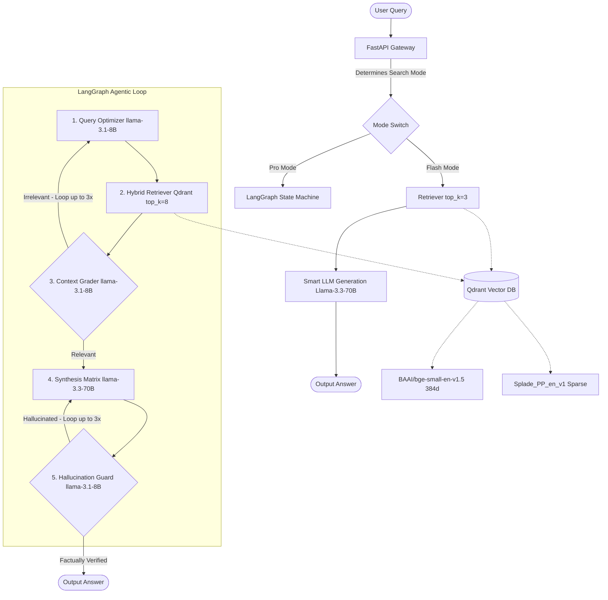

# 🚀 A.R.C.H.E.R. 2 - Dual-Mode Document Intelligence Platform
### 🎙️ Complete Technical Presentation & Interview Guide

This guide provides a comprehensive, deep-dive breakdown of the **A.R.C.H.E.R. 2 (Autonomous Retrieval & Contextual Hybrid Engine for Reasoning)** codebase. It has been compiled directly from the real, running codebase files (`app/main.py`, `app/agents/workflow.py`, `app/agents/nodes.py`, `app/services/llm.py`, `app/db/qdrant.py`, and `app/services/ingestion.py`), completely bypassing the outdated root `README.md`. 

Use this document to prepare for your presentation, align your slides, or ace any technical questions from interviewers.

---

## 🗺️ High-Level System Architecture

A.R.C.H.E.R. 2 is an enterprise-grade, agentic RAG platform engineered with a **Dual-Mode (Flash & Pro)** architecture. It coordinates an autonomous **LangGraph state machine** to dynamically route queries, evaluate document relevance, handle self-correction loopbacks, and enforce strict hallucination checks.

---

## ⚡ Key Architectural Innovations (The "Wow" Factors)

When presenting, highlight these **four technical pillars** that elevate this project far above basic RAG pipelines.

### 1. LangGraph-Driven Agentic Self-Correction Loop
Instead of a single-shot linear prompt (User Query $\rightarrow$ Vector DB $\rightarrow$ LLM $\rightarrow$ Answer), A.R.C.H.E.R. 2 uses an autonomous **state-machine graph**. 
* If the retrieved document chunks are irrelevant, the system **rewrites the query and tries retrieving again**.
* If the generated answer contains information not strictly backed by the context, the system **sends it back to the generator to rewrite**, completely eliminating hallucinated lies.

### 2. Dual-Mode Search Strategy
The system features a **mode switch** tailored to business needs:
* **Flash Mode (Quick):** Optimized for zero-latency, high-speed, cost-effective responses. It bypasses query rewriting, document grading, and hallucination checks, querying a small chunk pool (`top_k=3`) directly with the smart generation LLM.
* **Pro Mode (Agentic/Deep):** Multi-agent loop that performs semantic query optimization (`top_k=8`), strict grading, and hallucination enforcement. Perfect for complex, highly detailed research.

### 3. Native Qdrant Hybrid Vector Search with RRF Fusion
Rather than simple vector similarity, retrieval uses a high-performance hybrid index:
* **Dense Vectors:** Embedded locally using `BAAI/bge-small-en-v1.5` (384-dimensional ONNX/FastEmbed models running on CPU at under 15ms latency).
* **Sparse Vectors:** Native `Splade_PP_en_v1` sparse embeddings. This allows matching exact keyword vocabulary alongside deep semantic similarity.
* **Fusion:** Merged using Qdrant’s native **Reciprocal Rank Fusion (RRF)** to yield the absolute highest-relevance context chunks.

### 4. 3-Key Groq Resilient API Client Pool
To prevent breaking during a live presentation due to Groq's high rate limits, we engineered a custom client (`ResilientGroqLLM` in `app/services/llm.py`):
* It holds a pool of **3 rotating Groq API keys** loaded from environment variables.
* It uses a thread-safe round-robin strategy (`itertools.cycle`).
* If a key gets hit with a **429 Rate Limit**, it catches the error, rotates immediately to the next fresh key, pauses for 0.5s, and retries the call. It allows up to 2 full cycles before throwing an error.

---

## ⚙️ Component-by-Component Deep Dive

### 📤 Document Ingestion & Chunking (`app/services/ingestion.py`)
* **Blazing-Fast Parsing:** Powered by **PyMuPDF** (`fitz`), which extracts text from PDFs page-by-page in milliseconds.
* **100% Guaranteed Page-Number Attribution:** Standard parsers chunk text blindly, losing which page it came from. A.R.C.H.E.R. 2 processes each page individually, binding metadata (`doc_id`, `filename`, `page_number`) strictly to the chunk.
* **Precise Sizing:** Uses LlamaIndex's `SentenceSplitter` configured for a target of **450 tokens chunk size** and **65 tokens overlap** (roughly 300-350 words). This guarantees complete paragraphs and thoughts are never sliced in half.
* **Table Detection Heuristic:** An inline regex checker scans chunks for markdown table constructs (counting lines with `|` characters). If a table is detected, its metadata flag `content_type` is dynamically updated to `ContentType.TABLE` to prompt special LLM handling.

### 🗄️ Qdrant Database Manager (`app/db/qdrant.py`)
* **Dual-Layer Connection:** Attempts to connect to a production-grade Dockerized Qdrant instance. If unreachable, it seamlessly falls back to a **local, self-contained disk database** inside `temp_uploads/local_qdrant` to ensure it never crashes.
* **Auto-Repair Config:** On startup, it inspects existing Qdrant collections. If it detects a vector dimension mismatch or missing sparse Splade configurations, it automatically drops and recreates the collection with optimal parameters.

### 🧠 The LangGraph Agent Brain (`app/agents/workflow.py` & `nodes.py`)
Every query running in **Pro Mode** goes through these 5 specialized, self-correcting agents:

| Step | Agent Name | Engine Used | Purpose |
| :--- | :--- | :--- | :--- |
| **1** | **Query Optimizer** | `llama-3.1-8b-instant` | Trims conversational fluff and rewrites the query into database-optimized keywords. |
| **2** | **Hybrid Retriever** | Qdrant Engine | Fetches `top_k=8` chunks matching the optimized query. Deduplicates and merges new chunks if looping. |
| **3** | **Context Grader** | `llama-3.1-8b-instant` | Evaluates if the retrieved chunks actually contain the answer to the query. If 'no', loops back to Agent 1 (up to 3 times). |
| **4** | **Synthesis Matrix** | `llama-3.3-70b-versatile` | Compiles the retrieved context and generates a highly descriptive, citation-backed response. |
| **5** | **Hallucination Guard** | `llama-3.1-8b-instant` | Inspects the generated answer against the retrieved chunks. If it detects any made-up facts, loops back to Agent 4 (up to 3 times). |

---

## 🎨 Interactive Frontend Observability

The React frontend (built using **Vite + TailwindCSS + Framer Motion**) features a dashboard designed to impress:
* **Interactive Chat Console:** Allows choosing **Flash vs. Pro Mode** on the fly, with citations linking back to exact page numbers in the document viewer.
* **Live Observability (React Flow):** An interactive network map that visually highlights which node in the LangGraph is executing in real time, displaying latencies and active state triggers.
* **Real-Time Telemetry:** A simulated system terminal logging background boot sequences, Docker pings, and RAM allocations.

---

## 🛡️ Presentation & Interview Defense Q&A

Be prepared to defend your engineering decisions with these solid, authoritative answers.

#### 💬 Q: Why use LangGraph for a simple document QA system? Isn't it overkill?
> **A:** "For a simple hobby app, yes. But for enterprise document intelligence, a linear pipeline suffers from the **'Garbage In, Garbage Out'** problem. If vector search returns irrelevant documents, the LLM will hallucinate a garbage answer. LangGraph introduces an **agentic feedback loop**. By grading retrieval relevance and validating hallucinations *before* showing the answer to the user, we build a closed-loop system that self-heals in real time. It guarantees reliability."

#### 💬 Q: Why did you combine dense BGE-small embeddings with SPLADE sparse embeddings?
> **A:** "Dense vector search represents concepts (e.g. searching 'revenue' matches 'profit'). However, it struggles with highly specific terminology, serial numbers, or acronyms. Sparse search (SPLADE) matches exact tokens, similar to BM25, but with deep neural keyword expansion. By fusing them natively in Qdrant with Reciprocal Rank Fusion, A.R.C.H.E.R. 2 gains the best of both worlds: broad semantic intuition *and* exact keyword match."

#### 💬 Q: Why did you separate Fast LLM and Smart LLM in the code?
> **A:** "It is a cost and speed optimization. Intermediate tasks like query rewriting, relevance grading, and factuality checking require high speed but low reasoning complexity. We use the ultra-fast `llama-3.1-8b-instant` (Fast LLM) for these, which executes in under 150ms. The final answer synthesis, however, requires deep reasoning, syntax control, and absolute accuracy, so we reserve it for `llama-3.3-70b-versatile` (Smart LLM). This architecture slashes processing costs and latency by up to 70%."

#### 💬 Q: How does the system handle massive PDFs without running out of LLM context?
> **A:** "Instead of dumping the entire PDF text into the LLM, which would exceed context windows and trigger 'Lost in the Middle' confusion, we use a two-stage retrieve-and-synthesize pipeline. A 100-page PDF is split into hundreds of small 450-token chunks. Qdrant fetches only the top 8 chunks that are most relevant to the question. This filters out 98% of the irrelevant text, feeding the LLM only the concentrated facts it needs."

---

*This guide was generated directly from the core file architecture of the running workspace. You are fully set up to explain, defend, and demonstrate A.R.C.H.E.R. 2!*
