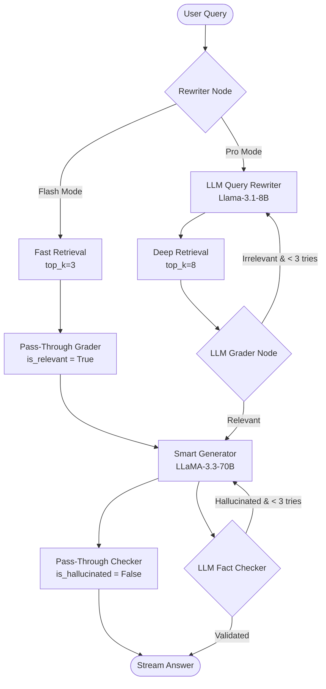

# 🛡️ A.R.C.H.E.R. — Autonomous Retrieval & Contextual Hybrid Engine for Reasoning

> **A high-resilience, production-grade dual-mode Agentic RAG platform for document intelligence. Stream accurate, fact-checked answers from complex PDFs with hybrid search and multi-agent validation.**

---

## 📌 Table of Contents

1. [Introduction: The Problem & The Solution](#1-introduction-the-problem--the-solution)
   - [The Problem (Why Naive RAG Fails in Production)](#the-problem-why-naive-rag-fails-in-production)
   - [The Engineered Solution (Enter A.R.C.H.E.R.)](#the-engineered-solution-enter-archer)
2. [Dual-Mode Cognitive Strategies (Flash Mode ⚡ vs. Pro Mode 🧠)](#2-dual-mode-cognitive-strategies-flash-mode--vs-pro-mode-)
3. [Multi-Agent Core & LangGraph Architecture](#3-multi-agent-core--langgraph-architecture)
   - [LangGraph Workflow Diagram](#langgraph-workflow-diagram)
   - [Agent Specifications](#agent-specifications)
4. [Depth Breakdown: The End-to-End RAG Pipeline](#4-depth-breakdown-the-end-to-end-rag-pipeline)
   - [Stage 1: High-Precision Page-Bounded Ingestion](#stage-1-high-precision-page-bounded-ingestion)
   - [Stage 2: Hybrid Dense-Sparse Vector Indexing](#stage-2-hybrid-dense-sparse-vector-indexing)
   - [Stage 3: Multi-Agent Query Processing & Relevance Grading](#stage-3-multi-agent-query-processing--relevance-grading)
   - [Stage 4: Cognitive Generation & Hallucination Checking](#stage-4-cognitive-generation-and-hallucination-checking)
   - [Stage 5: High-Performance Service Connectivity Pool](#stage-5-high-performance-service-connectivity-pool)
5. [API Key Configuration, Key Pool Rotation & Latency Profiles](#5-api-key-configuration-key-pool-rotation--latency-profiles)
6. [Trade-offs, Benefits & Disadvantages](#6-trade-offs-benefits--disadvantages)
7. [Project Directory & File Structure](#7-project-directory--file-structure)
8. [API Reference](#8-api-reference)
9. [Setup & Installation Guide](#9-setup--installation-guide)

---

## 1. Introduction: The Problem & The Solution

### The Problem (Why Naive RAG Fails in Production)
Standard "naive" Retrieval-Augmented Generation (RAG) pipelines follow a simple pattern: extract text, chunk it by a fixed character count (e.g., every 500 characters), embed those chunks using a basic embedding model, retrieve the top-$K$ chunks based on vector distance, and pass them to an LLM.

In real-world enterprise environments, this approach fails due to several key factors:
1. **Context Fragmentation & Sentence Mutilation:** Naive character-based splitting chops sentences in half, separating critical nouns from their modifying clauses, verbs, or statistical context.
2. **Diluted Retrieval (Bi-Encoder Limits):** Standard dense vector search (Bi-Encoders) is fast, but maps entire sentences/passages into a single vector space, often missing deep keyword-level overlaps or specific numeric metrics.
3. **The "Lost in the Middle" Syndrome:** Giving too much context (e.g., top-10 chunks) to an LLM degrades reasoning. The LLM tends to ignore the middle chunks, focusing only on the beginning or end of the context block.
4. **Factual Hallucinations:** Standard LLMs will aggressively hallucinate answers or blend out-of-context training data when the retrieved documents do not contain the answer, pretending the answer was in the document.
5. **Rate-Limiting & High Chained Latency:** Sequential multi-agent calls (Query Rewriting, Relevance Checking, Generation, Fact-Checking) multiply latencies, easily leading to API rate-limit errors and slow UI responses.

### The Engineered Solution (Enter A.R.C.H.E.R.)
A.R.C.H.E.R. (Autonomous Retrieval & Contextual Hybrid Engine for Reasoning) solves these limitations by implementing a production-first agentic architecture. 

A.R.C.H.E.R. uses a **Dual-Mode execution engine** (Quick Flash vs. Reasoning Pro), backed by a custom **multi-agent LangGraph workflow**. It replaces naive retrieval with **hybrid search** (combining dense vector search with sparse keyword-level SPLADE vectors) and adds a **two-stage agentic loop** (loopback query rewriting for irrelevant documents and regenerative hallucination checking).

---

## 2. Dual-Mode Cognitive Strategies (Flash Mode ⚡ vs. Pro Mode 🧠)

To balance execution speed and reasoning depth, A.R.C.H.E.R. provides two execution modes:

| Metric / Feature | Flash Mode ⚡ | Pro Mode 🧠 |
| :--- | :--- | :--- |
| **Primary Goal** | Sub-second latency, direct grounding | Ultra-high precision, self-correcting reasoning |
| **Pipeline Stages** | Direct Retrieval $\rightarrow$ Generation | Rewriter $\rightarrow$ Retrieval $\rightarrow$ Grader $\rightarrow$ Generator $\rightarrow$ Fact Checker |
| **Query Rewriter** | ⏩ Bypassed (Uses original query) | 🤖 Active (Llama-3.1-8B optimized keywords) |
| **Retrieval Depth** | `top_k=3` hybrid nodes | `top_k=8` hybrid nodes |
| **Relevance Grading** | ⏩ Bypassed (Pass-through) | 🤖 Active (Llama-3.1-8B relevance validation) |
| **Corrective Loops** | None (Direct output) | 🔁 Dynamic Loopback (Re-rewrites query up to 3 times) |
| **Fact-Checking** | ⏩ Bypassed (Direct output) | 🤖 Active (Llama-3.1-8B fact verification) |
| **Regeneration Loops** | None (Direct output) | 🔁 Dynamic Regeneration (Re-generates up to 3 times) |
| **LLM Generator** | `llama-3.3-70b-versatile` | `llama-3.3-70b-versatile` |
| **Average Latency** | **0.95s - 1.4s** | **5.2s - 7.5s** |

---

## 3. Multi-Agent Core & LangGraph Architecture

### LangGraph Workflow Diagram
Below is the execution graph powered by LangGraph, showing how states flow between agents depending on the active mode:



### Agent Specifications

A.R.C.H.E.R. splits reasoning into five specialized agents configured in [app/agents/nodes.py](file:///c:/Users/B.PAVANKALYAN%20REDDY/Desktop/Rag%20project2/ARCHER-2-DUAL-MODE/app/agents/nodes.py):

1. **Query Rewriter Agent (`rewrite_query`):**
   - **Mode Context:** Bypassed in Flash Mode.
   - **Function:** Eliminates conversational filler, corrects formatting, and extracts pure keyword structures optimized for sparse indexes and dense search.
   - **Model:** `llama-3.1-8b-instant` for low-latency rewriting.
2. **Hybrid Retriever Agent (`retrieve_context`):**
   - **Mode Context:** Pulls `top_k=3` in Flash Mode, `top_k=8` in Pro Mode.
   - **Function:** Performs a hybrid search over Qdrant, merging dense vectors and sparse SPLADE tokens to return relevant chunks.
3. **Relevance Grader Agent (`grade_documents`):**
   - **Mode Context:** Bypassed in Flash Mode (defaulting `is_relevant=True`).
   - **Function:** Evaluates the combined text of retrieved chunks. If the chunks are insufficient to answer the query, it triggers a fallback, returning the state back to the Query Rewriter.
   - **Model:** `llama-3.1-8b-instant`.
4. **Smart Generator Agent (`generate_answer`):**
   - **Mode Context:** Active in both modes.
   - **Function:** Formulates the final response grounded strictly in the retrieved context. It is strictly forbidden from using out-of-context knowledge.
   - **Model:** `llama-3.3-70b-versatile` (or fallback client).
5. **Hallucination Checker Agent (`check_hallucination`):**
   - **Mode Context:** Bypassed in Flash Mode.
   - **Function:** Compares the final response against the source context chunks to verify every assertion. If unsupported statements are found, it triggers a regeneration loop.
   - **Model:** `llama-3.1-8b-instant`.

---

## 4. Depth Breakdown: The End-to-End RAG Pipeline

A.R.C.H.E.R. processes documents and user queries through five structured stages:

```
[ PDF Upload ] ──▶ fitz (PyMuPDF) ──▶ SentenceSplitter (450 tokens) ──▶ Qdrant Hybrid Storage
                                                                               │
[ User Query ] ──▶ (Pro Mode: Query Rewriter) ───────────────────────────▶ Qdrant Hybrid Query
                                                                               │
                                                                               ▼
  [ Smart Generator (LLaMA-70B) ] ◀── (Pro Mode: Grader) ◀── [ Retrieve top_k Chunks ]
                 │
                 ▼
  [ Fact Checker (Llama-8B) ] ──▶ (Passed / Max Attempts) ──▶ [ Return Response with Citations ]
```

---

### Stage 1: High-Precision Page-Bounded Ingestion
**Component:** [app/services/ingestion.py](file:///c:/Users/B.PAVANKALYAN%20REDDY/Desktop/Rag%20project2/ARCHER-2-DUAL-MODE/app/services/ingestion.py)

#### Extraction
Using **PyMuPDF** (`fitz`), text is extracted page-by-page. Many general RAG tools load the entire document as a single string, losing page references. A.R.C.H.E.R. processes each page as a self-contained document, locking the page number into the metadata.

#### Sentence-Aware Semantic Chunking
A.R.C.H.E.R. uses LlamaIndex's `SentenceSplitter` configured for high precision:
- **Chunk Size:** 450 tokens (~300–350 words) to avoid embedding token truncation.
- **Chunk Overlap:** 65 tokens (~50 words) to preserve context at boundaries.
- **Table Detection Heuristics:** Evaluates line alignment and vertical pipe (`|`) frequency. Chunks that contain tables are tagged as `ContentType.TABLE` to help the LLM prioritize structured formatting.

---

### Stage 2: Hybrid Dense-Sparse Vector Indexing
**Component:** [app/db/qdrant.py](file:///c:/Users/B.PAVANKALYAN%20REDDY/Desktop/Rag%20project2/ARCHER-2-DUAL-MODE/app/db/qdrant.py)

```
                       ┌──────────────────────────────┐
                       │      Incoming Text Chunk     │
                       └──────────────┬───────────────┘
                                      │
               ┌──────────────────────┴──────────────────────┐
               ▼                                             ▼
  [ Dense Vector Encoding ]                     [ Sparse Token Expansion ]
    BAAI/bge-small-en-v1.5                        Splade_PP_en_v1
    (FastEmbed, 384 dimensions)                   (SPLADE sparse tokens)
               │                                             │
               ▼                                             ▼
  [ Qdrant Cosine Distance Index ]              [ Qdrant Sparse Index ]
               │                                             │
               └──────────────────────┬──────────────────────┘
                                      ▼
                       [ Reciprocal Rank Fusion (RRF) ]
```

A.R.C.H.E.R. combines semantic vector similarity with keyword matching using hybrid search:
1. **Dense Vector Embeddings:** Uses the `BAAI/bge-small-en-v1.5` model (384 dimensions) via **FastEmbed** (Rust-optimized with ONNX runtime). BGE-small runs efficiently on CPU and provides clean semantic mapping.
2. **Sparse Retrieval (SPLADE):** Uses `prithivida/Splade_PP_en_v1` via FastEmbed to generate sparse keyword tokens. This addresses a common limitation of dense vectors: matching specific product codes, identifiers, or terminology.
3. **Reciprocal Rank Fusion (RRF):** Qdrant merges dense and sparse scores natively, scoring and ranking chunks based on both semantic relevance and keyword overlap.
4. **Resilient Local Database Fallback:** If the Qdrant Docker container is offline, the backend initializes an on-disk embedded Qdrant database in `temp_uploads/local_qdrant/` automatically.

---

### Stage 3: Multi-Agent Query Processing & Relevance Grading
**Components:** [app/agents/workflow.py](file:///c:/Users/B.PAVANKALYAN%20REDDY/Desktop/Rag%20project2/ARCHER-2-DUAL-MODE/app/agents/workflow.py) and [app/agents/nodes.py](file:///c:/Users/B.PAVANKALYAN%20REDDY/Desktop/Rag%20project2/ARCHER-2-DUAL-MODE/app/agents/nodes.py)

In Pro Mode, queries pass through an optimization loop:
- **LLM-Based Query Reformulation:** The user's query is rewritten using Llama 3.1 8B. Fillers (e.g., *"Can you please show me..."*) are stripped, leaving key terms.
- **Active Relevance Filtering:** The Relevance Grader evaluates the retrieved chunks. If the content is flagged as irrelevant (`is_relevant = False`), the state machine loops back to the Query Rewriter to search again.
- **Infinite Loop Protection:** Loopbacks are capped at 3 attempts. If no relevant chunks are found after 3 tries, the system proceeds with the best available chunks to generate a response.

---

### Stage 4: Cognitive Generation & Fact-Checking
**Component:** [app/agents/nodes.py](file:///c:/Users/B.PAVANKALYAN%20REDDY/Desktop/Rag%20project2/ARCHER-2-DUAL-MODE/app/agents/nodes.py)

#### Generation
The system prompt enforces strict constraints. The LLM must answer using *only* the retrieved context and is instructed to reply with *"I don't know"* if the answer is missing, preventing hallucinated responses. The generation temperature is set to `0.3` to prioritize accuracy.

#### Fact-Checking Loop
In Pro Mode, the Fact-Checker compares the generated response to the source context chunks.
- If a statement is unsupported by the context (`is_hallucinated = True`), the state is sent back to the Smart Generator with feedback to rewrite the response.
- Like the relevance grading loop, this cycle is capped at 3 attempts to prevent infinite execution loops.

---

### Stage 5: High-Performance Service Connectivity Pool
**Component:** [app/services/llm.py](file:///c:/Users/B.PAVANKALYAN%20REDDY/Desktop/Rag%20project2/ARCHER-2-DUAL-MODE/app/services/llm.py)

To reduce latency, A.R.C.H.E.R. implements two performance optimizations:
1. **Pre-instantiated Connection Pooling:** LLM client connections are pre-warmed using TCP Keep-Alive. Reusing connections avoids the overhead of establishing new TCP/TLS handshakes for each request, shaving ~400ms off sequentially chained agent calls.
2. **Lazy-Load Singleton Services:** The FastAPI backend ([app/main.py](file:///c:/Users/B.PAVANKALYAN%20REDDY/Desktop/Rag%20project2/ARCHER-2-DUAL-MODE/app/main.py)) loads heavy services (like the BGE embedding and SPLADE model configurations) lazily upon the first request. This keeps the initial server boot time fast (under 1 second).

---

## 5. API Key Configuration, Key Pool Rotation & Latency Profiles

### The Key Rotation Strategy
Because agentic workflows make multiple LLM calls per query, rate limits (TPM/RPM) are a common bottleneck. A.R.C.H.E.R. uses a round-robin key pool manager (`ResilientGroqLLM` in [app/services/llm.py](file:///c:/Users/B.PAVANKALYAN%20REDDY/Desktop/Rag%20project2/ARCHER-2-DUAL-MODE/app/services/llm.py)):

- The system cycles through three API keys (`GROQ_API_KEY_1`, `GROQ_API_KEY_2`, `GROQ_API_KEY_3`).
- If an API key encounters an HTTP 429 Rate Limit error, the client logs a warning, waits for 500ms, and automatically retries the request using the next key in the pool.
- The pool allows up to two full rotation cycles before throwing an error.

### Latency Profiles

```
FLASH MODE ⚡ (Total Latency: ~1.15s)
[Qdrant Hybrid Retrieval] ── (150ms) ──▶ [LLaMA-3.3-70B Answer Gen] ── (1000ms) ──▶ Stream Answer

PRO MODE 🧠 (Total Latency: ~6.2s)
[Query Rewrite] ── (600ms) ──▶ [Qdrant Hybrid Retrieval] ── (150ms) ──▶ [LLM Relevance Grading] ── (650ms)
                                                                                  │
[Fact-Checker] ◀── (800ms) ◀── [LLaMA-3.3-70B Answer Gen] ◀── (3000ms) ◀──────────┘
      │
      ▼
Stream Answer
```

---

## 6. Trade-offs, Benefits & Disadvantages

### Benefits
- **Fact-Checked Accuracy:** The combination of relevance grading and fact-checking helps ensure responses are grounded in the source text.
- **Robust Retrieval:** Dense vector search combined with SPLADE sparse keyword indexing captures both semantic concepts and specific terminology.
- **Resilient Infrastructure:** The system handles rate limits using API key rotation and falls back to local on-disk vector storage if the Docker container is offline.
- **High-Performance Client:** TCP Keep-Alive connection pooling reduces handshaking overhead for chained LLM calls.

### Disadvantages / Trade-offs
- **Increased Inference Cost:** Pro Mode requires multiple LLM queries (rewriting, grading, fact-checking) for a single user question, increasing API token usage.
- **Slower Responses in Pro Mode:** The verification loops in Pro Mode increase overall latency (5 to 8 seconds) compared to direct generation.
- **Local Ingestion Time:** Extracting and embedding large files on CPU can be slow, though ingestion runs as a background task to keep the UI responsive.

---

## 7. Project Directory & File Structure

```
ARCHER-2-DUAL-MODE/
│
├── .agents/                     # Workflow definitions & configurations
├── app/                         # Backend Source Code (FastAPI)
│   ├── main.py                  # API endpoints, background worker, lazy loaders
│   ├── agents/                  # LangGraph Multi-Agent configurations
│   │   ├── nodes.py             # Agent node implementations (Grader, Rewriter, Checker)
│   │   ├── state.py             # Shared state definitions
│   │   └── workflow.py          # StateGraph routing rules & loop logic
│   ├── core/                    # App settings and environment configs
│   ├── db/                      # Vector database configurations
│   │   └── qdrant.py            # Qdrant client, native hybrid indexes, local fallback
│   ├── models/                  # Pydantic schema validation models
│   └── services/                # Backend services
│       ├── embedding.py         # FastEmbed BGE dense embeddings
│       ├── ingestion.py         # PyMuPDF sentence-aware document chunking
│       ├── llm.py               # Pre-warmed Groq pool & key rotation logic
│       └── retrieval.py         # Retrieval wrapper
│
├── frontend/                    # Frontend Source Code (React + Vite)
│   ├── src/
│   │   ├── components/          # Reusable UI elements (Buttons, Upload boxes)
│   │   ├── pages/               # Main layout pages
│   │   │   ├── ChatPage.jsx     # Segmented toggles, thinking steps, streams
│   │   │   ├── ArchitecturePage.jsx
│   │   │   └── Dashboard.jsx
│   │   ├── store.js             # Global state manager
│   │   ├── App.jsx
│   │   └── index.css            # Styling & themes
│   └── package.json
│
├── docker-compose.yml           # Runs Qdrant locally
├── requirements.txt             # Backend dependencies
├── .env.example                 # Environment template
└── README.md                    # System documentation
```

---

## 8. API Reference

### `POST /upload`
Uploads a PDF file. Ingestion and indexing run as a background task.

- **Request:** `multipart/form-data` with `file: File` (.pdf only).
- **Response:**
  ```json
  {
    "doc_id": "8c59f2be-4971-424a-9db7-f705118c7bf9",
    "filename": "annual_report.pdf",
    "status": "processing"
  }
  ```

### `GET /status/{doc_id}`
Returns the current ingestion progress for a document.

- **Response:**
  ```json
  {
    "doc_id": "8c59f2be-4971-424a-9db7-f705118c7bf9",
    "filename": "annual_report.pdf",
    "status": "ready",
    "progress": 100.0,
    "chunk_count": 42
  }
  ```

### `POST /query`
Runs a query through the RAG pipeline.

- **Request:** `application/json`
  ```json
  {
    "question": "What was the revenue growth in 2025?",
    "search_mode": "pro",
    "doc_id": "8c59f2be-4971-424a-9db7-f705118c7bf9"
  }
  ```
- **Response:**
  ```json
  {
    "answer": "The revenue grew by 14.2% in 2025, reaching $4.2B.",
    "sources": [3, 12],
    "context_used": [...]
  }
  ```

---

## 9. Setup & Installation Guide

### Prerequisites
- **Python 3.9+**
- **Node.js 18+**
- **Docker** (Optional, for running Qdrant)

### Running the Services

#### 1. Start Qdrant (Docker)
```powershell
docker-compose up -d
```
*Note: If Docker is unavailable, the backend will automatically fallback to an on-disk embedded Qdrant instance.*

#### 2. Start the Backend
1. Create a Python virtual environment and activate it:
   ```powershell
   python -m venv venv
   # Windows
   .\venv\Scripts\activate
   # macOS/Linux
   source venv/bin/activate
   ```
2. Install dependencies:
   ```powershell
   pip install -r requirements.txt
   ```
3. Set up environment variables. Create a `.env` file from the example template:
   ```powershell
   copy .env.example .env
   ```
   Add your Groq API keys to the `.env` file:
   ```
   GROQ_API_KEY_1=gsk_...
   GROQ_API_KEY_2=gsk_...
   GROQ_API_KEY_3=gsk_...
   QDRANT_URL=http://localhost:6333
   ```
4. Start the server using Uvicorn:
   ```powershell
   uvicorn app.main:app --reload
   ```

#### 3. Start the Frontend
1. Navigate to the frontend directory and install package dependencies:
   ```powershell
   cd frontend
   npm install
   ```
2. Start the development server:
   ```powershell
   npm run dev
   ```
   Open `http://localhost:5173` in your browser to view the application.

---
*Built with ❤️ using FastAPI, LangGraph, Qdrant, FastEmbed, Groq, and React.*
